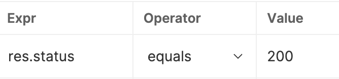
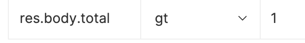

# apitestingusingbruno

This repo. which helps us to test API using bruno

We can add assertions in #Assert Tab for the individual API. 

Following are the assertions which we can use to test the API - 

1. For verifying the API Status code - 
   Add res.status in Expr, Operator - equals and expected status.
   

2. For verifying that a particular value in JSON is greater than a given value - 
    res.body.filedName in Expr, Opertaor - gt and expected value 
    

3. To add Query Parameter, add the following -

